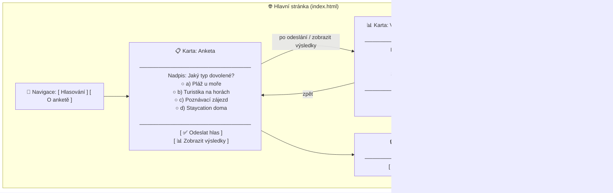
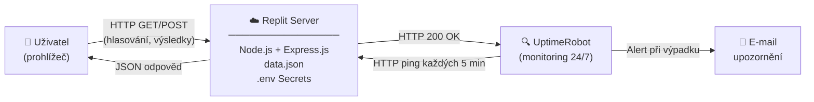

# 🗳️ Hlasovací aplikace – Jaký typ dovolené?

**Autor:** Alexandre Basseville  
**Platforma:** Replit (Node.js)  
**Framework:** Express.js  

---

## 📋 Popis projektu

Jednoduchá webová aplikace pro hlasování v anketě. Uživatelé hlasují pro jeden ze čtyř typů dovolené. Výsledky jsou sdílené pro všechny návštěvníky a uloženy v souboru `data.json`, takže přežijí restart serveru.

Aplikace je hostována na platformě **Replit** a monitorována službou **UptimeRobot**.

---

## 📁 Struktura složek

```
voting-app/
├── server.js          # Backend – Express.js server, API endpointy
├── data.json          # Databáze hlasů (JSON soubor na serveru)
├── package.json       # Závislosti Node.js projektu
├── .env.example       # Vzor proměnných prostředí (pro lokální vývoj)
└── public/
    ├── index.html     # Hlavní stránka – anketa a výsledky
    ├── about.html     # Stránka „O anketě"
    └── style.css      # Styly – moderní, responzivní design
```

---

## 🌐 Endpointy (URL adresy)

| Metoda | URL          | Popis                                                                 |
|--------|--------------|-----------------------------------------------------------------------|
| GET    | `/`          | Hlavní stránka s anketou (`public/index.html`)                        |
| GET    | `/about.html`| Stránka „O anketě"                                                    |
| GET    | `/results`   | Vrátí aktuální výsledky hlasování jako JSON                           |
| POST   | `/vote`      | Uloží hlas; tělo: `{ "option": "a" }` (a/b/c/d)                      |
| POST   | `/reset`     | Vynuluje hlasy; tělo: `{ "token": "..." }` (token ověřen ze Secrets) |

---

## 🖼️ Wireframe diagram

Přibližné rozložení prvků na hlavní stránce (`index.html`):



---

## 🏗️ Deployment diagram

Diagram znázorňuje komunikaci mezi uživatelem, serverem a monitorovací službou:



---

## 🚀 Postup nasazení na Replit (krok za krokem)

### 1. Vytvoření projektu
1. Přihlaste se na [replit.com](https://replit.com).
2. Klikněte na **+ Create Repl**.
3. Vyberte šablonu **Node.js**.
4. Pojmenujte projekt (např. `voting-app`) a potvrďte.

### 2. Nahrání souborů
1. V levém panelu klikněte na ikonu **Files**.
2. Nahrajte nebo překopírujte tyto soubory:
   - `server.js` – do kořenové složky
   - `data.json` – do kořenové složky
   - `package.json` – do kořenové složky
   - `public/index.html` – vytvořte složku `public/` a vložte
   - `public/about.html` – vložte do `public/`
   - `public/style.css` – vložte do `public/`

### 3. Nastavení tajného tokenu
1. V levém panelu klikněte na **Tools → Secrets** (nebo ikona zámku 🔒).
2. Přidejte nový secret:
   - **Key:** `RESET_TOKEN`
   - **Value:** vaše heslo (např. `MojeHeslo123!`)
3. Uložte.

### 4. Instalace závislostí a spuštění
1. Replit automaticky spustí `npm install` při prvním spuštění.
2. Klikněte na zelené tlačítko **▶ Run**.
3. Aplikace se zobrazí v pravém panelu (vestavěný prohlížeč) nebo na URL:  
   `https://nazev-vascho-replu.uzivatelske-jmeno.repl.co`

### 5. Nasazení nové verze kódu
1. Upravte soubory přímo v editoru Replit.
2. Klikněte na **▶ Run** – server se restartuje automaticky.
3. Změny jsou okamžitě dostupné na vaší URL adrese.

> **Tip:** Pokud Replit projekt po určité době nečinnosti „usne", lze to vyřešit nastavením UptimeRobot (viz níže) nebo upgradovat na Replit Always On.

---

## 📡 Monitoring s UptimeRobot

UptimeRobot je bezplatná služba, která hlídá dostupnost vaší aplikace 24 hodin denně, 7 dní v týdnu.

### Jak nastavit monitoring:

1. **Registrace:** Jděte na [uptimerobot.com](https://uptimerobot.com) a vytvořte bezplatný účet.

2. **Přidání monitoru:**
   - Klikněte na **+ Add New Monitor**.
   - Monitor Type: **HTTP(s)**.
   - Friendly Name: `Hlasovaci aplikace`.
   - URL: vložte URL vašeho Replit projektu (např. `https://voting-app.uzivatel.repl.co`).
   - Monitoring Interval: **Every 5 minutes**.
   - Potvrďte kliknutím na **Create Monitor**.

3. **Nastavení e-mailových upozornění:**
   - V nastavení monitoru přejděte do sekce **Alert Contacts**.
   - Klikněte na **+ Add Alert Contact**.
   - Typ: **E-mail**.
   - Zadejte svůj e-mail a potvrďte.
   - UptimeRobot vám pošle potvrzovací e-mail – ten potvrďte.

4. **Výsledek:**
   - UptimeRobot bude každých 5 minut posílat HTTP požadavek na vaši URL.
   - Pokud server neodpoví (výpadek), dostanete okamžitě upozornění na e-mail.
   - Navíc pravidelné pingy zabraňují tomu, aby Replit projekt „usnul".

---

## 🔧 Lokální spuštění (volitelné)

```bash
# 1. Naklonuj nebo stáhni projekt
cd voting-app

# 2. Nainstaluj závislosti
npm install

# 3. Vytvoř soubor .env (zkopíruj z .env.example)
cp .env.example .env
# Uprav RESET_TOKEN na své heslo

# 4. Spusť server
npm start

# 5. Otevři v prohlížeči
# http://localhost:3000
```

---

*Dokumentace vytvořena pro školní projekt – Alexandre Basseville*
