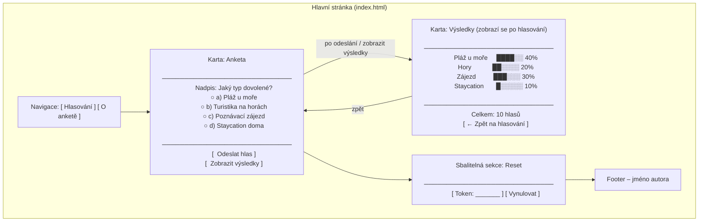
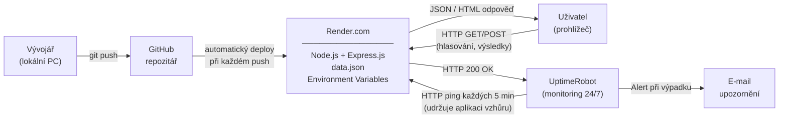

#  Hlasovací aplikace – Jaký typ dovolené?

**Autor:** Alexandre Basseville  
**Platforma:** Render.com (propojeno s GitHubem)  
**Framework:** Express.js  
---

##  Popis projektu

Jednoduchá webová aplikace pro hlasování v anketě. Uživatelé hlasují pro jeden ze čtyř typů dovolené. Výsledky jsou sdílené pro všechny návštěvníky a uloženy v souboru `data.json`, takže přežijí restart serveru.

Aplikace je hostována na platformě **Render.com** (propojené s GitHub repozitářem) a monitorována službou **UptimeRobot**, která ji každých 5 minut pinguje, aby aplikace neusnula a soubor `data.json` nebyl smazán.

---

##  Struktura složek

```
voting-app/
├── server.js          # Backend – Express.js server, API endpointy
├── data.json          # Databáze hlasů (JSON soubor na serveru)
├── package.json       # Závislosti Node.js projektu
├── .env.example       # Vzor proměnných prostředí (pro lokální vývoj)
└── public/
    ├── index.html     # Hlavní stránka – anketa a výsledky
    ├── about.html     # Stránka „O anketě"
    └── style.css      # Styly – moderní, responzivní design
```

---

##  Endpointy (URL adresy)

| Metoda | URL          | Popis                                                                 |
|--------|--------------|-----------------------------------------------------------------------|
| GET    | `/`          | Hlavní stránka s anketou (`public/index.html`)                        |
| GET    | `/about.html`| Stránka „O anketě"                                                    |
| GET    | `/results`   | Vrátí aktuální výsledky hlasování jako JSON                           |
| POST   | `/vote`      | Uloží hlas; tělo: `{ "option": "a" }` (a/b/c/d)                      |
| POST   | `/reset`     | Vynuluje hlasy; tělo: `{ "token": "..." }` (token ověřen z Environment Variables) |

---

##  Wireframe diagram

Přibližné rozložení prvků na hlavní stránce (`index.html`):



---

##  Deployment diagram

Diagram znázorňuje celý tok od vývoje až po monitoring:



---

##  Postup nasazení na Render.com (krok za krokem)

### 1. Příprava a nahrání kódu na GitHub

1. Přihlaste se nebo se zaregistrujte na [github.com](https://github.com).
2. Klikněte na **+ New repository**, pojmenujte ho (např. `voting-app`) a potvrďte **Create repository**.
3. Otevřete terminál ve VS Code (`Ctrl + `` ` ```) v kořenové složce projektu a spusťte:

```bash
git init
git add .
git commit -m "První verze hlasovací aplikace"
git branch -M main
git remote add origin https://github.com/VASE-UZIVATELSKE-JMENO/voting-app.git
git push -u origin main
```

4. Obnovte stránku repozitáře na GitHubu – měli byste vidět všechny nahrané soubory včetně složky `public/`.

> **Důležité:** Ujistěte se, že soubor `.env` **není** nahrán na GitHub (obsahuje hesla). Soubor `.env.example` nahrát lze.

---

### 2. Propojení GitHubu s Render.com

1. Přihlaste se nebo se zaregistrujte na [render.com](https://render.com) (bezplatný účet stačí).
2. Na hlavním dashboardu klikněte na **+ New → Web Service**.
3. Zvolte **Connect a GitHub repository** a autorizujte Render přístup k vašemu GitHub účtu.
4. Ze seznamu vyberte repozitář `voting-app` a klikněte na **Connect**.

---

### 3. Nastavení Web Service

Na stránce konfigurace vyplňte:

| Pole | Hodnota |
|------|---------|
| **Name** | `voting-app` (nebo libovolný název) |
| **Region** | Frankfurt (EU) – nejblíže ČR |
| **Branch** | `main` |
| **Runtime** | `Node` |
| **Build Command** | `npm install` |
| **Start Command** | `node server.js` |
| **Instance Type** | `Free` |

Potvrďte kliknutím na **Create Web Service**.

---

### 4. Nastavení Environment Variable (tajný token)

Heslo pro reset hlasů **nesmí být v kódu** – nastavte ho přímo v Renderu:

1. V dashboardu vašeho Web Service přejděte do záložky **Environment**.
2. Klikněte na **Add Environment Variable**.
3. Vyplňte:
   - **Key:** `RESET_TOKEN`
   - **Value:** vaše heslo (např. `MojeHeslo2025!`)
4. Klikněte na **Save Changes** – Render server automaticky restartuje.

---

### 5. Spuštění a ověření

1. Přejděte do záložky **Logs** – sledujte průběh buildu a spuštění.
2. Jakmile uvidíte ` Server běží na portu ...`, aplikace je živá.
3. Vaše URL adresa bude vypadat takto:  
   `https://voting-app.onrender.com`

---

### 6. Nasazení nové verze kódu

Díky propojení s GitHubem je aktualizace jednoduchá:

1. Upravte soubory ve VS Code.
2. Uložte změny a spusťte v terminálu:

```bash
git add .
git commit -m "Popis změny"
git push
```

3. Render zachytí nový commit a **automaticky spustí nový deploy** – bez nutnosti cokoli klikat na webu.

---

##  Monitoring s UptimeRobot

UptimeRobot je bezplatná služba, která hlídá dostupnost aplikace 24 hodin denně, 7 dní v týdnu. Na bezplatném plánu Renderu aplikace po 15 minutách nečinnosti „usne" – UptimeRobot tomu zabrání pravidelným pingováním.

### Jak nastavit monitoring:

1. **Registrace:** Jděte na [uptimerobot.com](https://uptimerobot.com) a vytvořte bezplatný účet.

2. **Přidání monitoru:**
   - Klikněte na **+ Add New Monitor**.
   - Monitor Type: **HTTP(s)**.
   - Friendly Name: `Hlasovaci aplikace`.
   - URL: vložte URL vašeho Render projektu (např. `https://voting-app.onrender.com`).
   - Monitoring Interval: **Every 5 minutes**.
   - Potvrďte kliknutím na **Create Monitor**.

3. **Nastavení e-mailových upozornění:**
   - V nastavení monitoru přejděte do sekce **Alert Contacts**.
   - Klikněte na **+ Add Alert Contact**.
   - Typ: **E-mail**.
   - Zadejte svůj e-mail a potvrďte.
   - UptimeRobot vám pošle potvrzovací e-mail – ten potvrďte.

4. **Výsledek:**
   - UptimeRobot bude každých 5 minut posílat HTTP požadavek na vaši URL.
   - Pokud server neodpoví (výpadek), dostanete okamžitě upozornění na e-mail.
   - Pravidelné pingy zároveň zabraňují uspání aplikace a tím i ztrátě dat v `data.json`.

---

##  Lokální spuštění (volitelné)

```bash
# 1. Naklonuj projekt z GitHubu
git clone https://github.com/VASE-UZIVATELSKE-JMENO/voting-app.git
cd voting-app

# 2. Nainstaluj závislosti
npm install

# 3. Vytvoř soubor .env (zkopíruj z .env.example)
cp .env.example .env
# Uprav RESET_TOKEN na své heslo

# 4. Spusť server
npm start

# 5. Otevři v prohlížeči
# http://localhost:3000
```

---

*Dokumentace vytvořena pro školní projekt – Alexandre Basseville*
